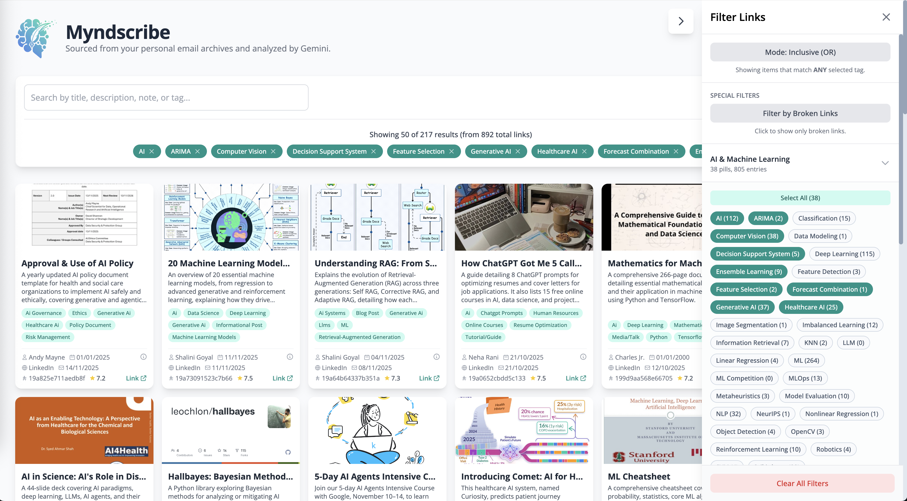

# Myndscribe: Your mind's personal curator.


[](https://www.python.org/)
[](LICENSE)
[]()
[]()
[]()

✨  ***Turn your self-sent emails into an organized knowledge base.***

**Myndscribe** is an AI-powered personal knowledge curator that reads emails you 
send to yourself, extracts their content, analyzes attached links, and creates a 
concise summary. All your self-sent thoughts are transformed into a beautifully 
organized web interface — making it easy to rediscover, reflect, and build your 
second brain.



## 🌱 Origin of the Name

> **Myndscribe** = “Mynd” (Old Norse for *mind*, also a play on “my mind”) + “scribe” (one who writes).

Together, it means **“the scribe of your mind.”**  
It’s your digital assistant that listens to what you send to yourself, distills it, and gives it back to you as structured insight.

---

## 🗂️ Table of Contents

1. [Features](#-features)
2. [Tech Stack](#-tech-stack)
3. [Getting Started](#-getting-started)
4. [Architecture Overview](#-architecture-overview)
6. [Tailwind](#-tailwind)
7. [Roadmap](#-roadmap)
8. [Contributing](#-contributing)
9. [License](#-license)

---

## 🚀 Features

- 📬 **Email Collector** – Connects to Gmail (or any IMAP service) and retrieves self-sent emails.
- 🧾 **Intelligent Parser** – Extracts body text, attachments, and links.
- 🤖 **AI Analysis** – Uses Gemini, GPT-5, or any LLM to summarize and tag content.
- 🧱 **Structured Storage** – Saves results to SQLite or PostgreSQL.
- 🌐 **Web Dashboard** – Clean, searchable interface for browsing your insights.
- 🔁 **Automated Updates** – Periodically fetches and curates new emails.
- 🔒 **Private by Design** – All processing runs locally or within your own cloud account.

---

## 🧰 Tech Stack

| Component | Technology |
|------------|-------------|
| Language | Python 3.11 |
| Backend | None |
| Frontend | HTML / CSS (tailwind) / JS  |
| Database | Local FS |
| Email Integration | Gmail API  |
| AI Engine | Gemini  |
| Storage | Local FS |
| Auth | OAuth 2.0 |
| Deployment | GitHub Actions |

---

## 🏁 Getting Started

> **Note:** Setup instructions are under active development — this section will be updated soon.

#### Local setup

To run this project locally, you need to configure access for both the Gmail API 
and the Google Gemini API. Follow the steps below to generate the necessary 
credentials and environment variables.


##### A. Gmail API Setup (Google Cloud)
**Goal:** Generate the `credentials.json` file.

1.  **Create a Project:**
    * Go to the [Google Cloud Console](https://console.cloud.google.com/).
    * Click the project dropdown (top left) > **New Project**. Name it (e.g., "myndscribe"") and click **Create**.
2.  **Enable the API:**
    * Navigate to **APIs & Services > Library**.
    * Search for "Gmail API", click on it, and select **Enable**.
3.  **Configure OAuth Consent:**
    * Go to **APIs & Services > OAuth consent screen**.
    * Select **External** (or Internal if G-Suite) and click **Create**.
    * Fill in the *App Name* (e.g., "myndscribe"), *User Support Email*, and *Developer Contact Info*.
    * **Important:** Under **Test Users**, click "Add Users" and enter your own email address. This authorizes your specific account during testing.
4.  **Create Credentials:**
    * Go to **APIs & Services > Credentials**.
    * Click **+ CREATE CREDENTIALS** > **OAuth client ID**.
    * Select **Desktop app** as the application type.
    * Name it (e.g., "Macbook Pro 16") and click **Create**.
    * Download the JSON file, rename it to `credentials.json`, and place it in the root directory of this project.

##### B. Google Gemini API Setup
**Goal:** Generate the `GEMINI_API_KEY`.

1.  Go to [Google AI Studio](https://aistudio.google.com/).
2.  Click on **Get API key** (top left).
3.  Click **Create API key**. You can create it in a new project or link it to the existing Google Cloud project you created in step 1.
4.  Copy the generated key string.

##### C. Local Environment & File Setup

###### C.1. Clone the repository
Use these combined steps to clone the repository, set up the virtual environment and install
all the dependencies. 

```bash
# Clone the repository and navigate into the directory
git clone https://github.com/yourusername/myndscribe.git
cd myndscribe

# Create and activate the Python 3.11 virtual environment
python3.11 -m venv .venv
source .venv/bin/activate 

# Install required dependencies
pip install -r requirements.txt
```

###### C.2. Configuration (The `.env` File)

Your `.env` file is used for authentication and secrets.

| Variable | Purpose | Example |
|----------|----------|---------|
| `GEMINI_API_KEY` | **MANDATORY** Gemini API key | `"AIzaSy...your...key...here"` |
| `LINKEDIN_COOKIE` | OPTIONAL manual `li_at` cookie | `"AQED...your...cookie"` |
| `FACEBOOK_COOKIE` | OPTIONAL manual `c_user` cookie | `"your_fb_cookie_value"` |

The pipeline includes an option to automatically extract cookies from local browser 
profiles (Chrome or Firefox). However, relying on this method is generally discouraged 
for production stability: Chrome extraction often fails due to database locking, 
potentially requiring the browser to be fully closed. While Firefox tends to be more 
stable for this operation, using undetected methods is inherently brittle as they rely 
on a low user base and their underlying libraries are often less advances than chrome's. 
Furthermore, mixing authentication tokens—for example, retrieving a cookie from Firefox 
but injecting it into a Chrome-based Selenium session—is not ideal, as session cookies 
are often tied to specific browser profiles and client headers, compromising the goal 
of faking a legitimate, single-browser user identity. For maximum reliability and to 
ensure stable, long-running sessions, manual cookie input via the .env file is highly 
recommended.

**How to get cookies from browsers:**  
Log in → DevTools (F12) → Application → Storage → Cookies → Copy full cookie value.

Ensure your local project folder is set up with the following files:

* **`credentials.json`**: The file you downloaded from Google Cloud in Step 1.
* **`GEMINI_API_KEY`**: Set this as an environment variable.
    * *Option A (.env file):* Create a `.env` file in the root and add: `GEMINI_API_KEY=your_api_key_here`
    * *Option B (Terminal):* Export it in your shell: `export GEMINI_API_KEY="your_api_key_here"`
* **`token.json`**: 
    **Do not create this manually.** When you run the script for the first time, a browser 
    window will open asking you to log in to Google. Once authorized, the script will automatically 
    generate this file to store your access tokens.

> **Security Note:** Ensure `credentials.json`, `token.json`, and `.env` are added to your `.gitignore` file so they are not pushed to GitHub.


#### C.3. Running the Pipeline

The pipeline executes via `main.py` using the Python module system.

##### **A. Run All Default Steps**

Runs all steps in `config/config.yaml`:

```bash
python -m main
```

##### B. Run Specific Steps

Example: run only aggregate + tagging:

```bash
python -m main --steps aggregate tags
```

#### GitHub Actions (CI)

Explain what secrets and how to set them.


## 🧩 Architecture Overview

This section the architecture, configuration, and execution of the 
**Myndscribe Data Pipeline**, an Extract, Transform, and Load (ETL) system 
designed to ingest links from email, analyze web content using Gemini, and 
standardize metadata for front-end consumption.

The pipeline uses a **Modular Strategy Pattern** and a 
**Singleton Configuration** to achieve high extensibility and 
maintainability.

#### Folder structure

Based on the modular architecture we built, here is the complete folder and 
file structure you should have. Files are categorized by their role (Source, 
Configuration, Authentication, Output).

```bash
myndscribe/
├── .env                       <-- 🔑 AUTHENTICATION/SECRETS (Manually created)
├── credentials.json           <-- 🔑 GMAIL AUTH (Downloaded from Google Cloud)
├── main.py                    <-- 🚀 PIPELINE ENTRY POINT
├── token.json                 <-- 🔑 GMAIL AUTH (Automatically generated on first run)
├── README.md                  <-- 📄 PROJECT DOCUMENTATION

├── config/
│   ├── config.yaml            <-- ⚙️ MAIN SETTINGS (Paths, Strategy toggles)
│   └── prompts.yaml           <-- 🗣️ LLM PROMPT TEMPLATES
│
├── outputs/
│   ├── emails/                <-- 📥 STEP 1 & 2 INPUT/OUTPUT
│   │   ├── email_id_123.json  <-- Raw Email Metadata (Gmail Ingest)
│   │   └── email_id_123.gemini.json <-- Link Analysis Results (Smart Processor)
│   │
│   └── pipeline/              <-- 🛠️ STEP 3, 4, 5 WORKING DIRECTORY
│       ├── data.json          <-- Aggregated Raw Data (Aggregator Step)
│       ├── tags_config_pro.json <-- Tag Map & Categories (Tag Management Step)
│       └── data_processed.json<-- Final Cleaned Data (Converter Input)
│
├── src/
│   ├── core/
│   │   ├── config_loader.py   <-- Loads config.yaml and .env
│   │   ├── interfaces.py      <-- Abstract Base Classes (Contracts)
│   │   └── __init__.py
│   ├── steps/                 <-- 🔄 PIPELINE STAGES
│   │   ├── aggregator.py      <-- Combines all analysis files
│   │   ├── converter.py       <-- Converts final JSON to data.js
│   │   ├── email_ingest.py    <-- Downloads emails from Gmail
│   │   ├── smart_processor.py <-- Routes fetching, runs guardrails & Gemini
│   │   ├── tag_management.py  <-- Extracts, consolidates, and standardizes tags
│   │   └── __init__.py
│   ├── strategies/            <-- 🔨 PLUGGABLE LOGIC
│   │   ├── fetchers.py        <-- Simple HTTP, LinkedInFetcher, FacebookFetcher, FetchRouter
│   │   ├── guardrails.py      <-- PII, Broken Link, etc. checks
│   │   └── __init__.py
│   └── __init__.py
|
└── playground                 <-- Try new ideas!
```

#### Key File Roles Explained

| File               | Location        | Purpose                                                                 | Status                               |
|-------------------|------------------|-------------------------------------------------------------------------|---------------------------------------|
| `.env`            | Project Root     | **Secrets:** Holds `GEMINI_API_KEY`, `LINKEDIN_COOKIE`, etc.            | Manual (must be created and filled)   |
| `credentials.json`| Project Root     | **Gmail Auth Config:** Client secret file from Google Cloud Console.    | Required (downloaded)                 |
| `token.json`      | Project Root     | **Gmail Auth Token:** Stores OAuth tokens after first successful login. | Auto-generated                        |
| `main.py`         | Project Root     | **Execution:** Initializes the `Pipeline` class and handles CLI args.   | Source Code                           |
| `config.yaml`     | `config/`        | **Configuration:** Directory paths and strategy settings.                | Source Code                           |
| `data.json`       | `outputs/pipeline/` | **Intermediate Data:** Output of the aggregate stage.                  | Auto-generated                        |


#### Key Concepts

| Component | Role | Description |
|----------|------|-------------|
| **Pipeline (Orchestrator)**<br>`src/pipeline.py` | Controls the flow | Defines the sequence of execution steps (ingest, process, aggregate, etc.). |
| **Steps**<br>`src/steps/*` | Independent units of work | Implement the `PipelineStep` interface and contain business logic. |
| **Strategies**<br>`src/strategies/*` | Plug-and-play modules | Fetchers & Guardrails encapsulating domain-specific logic. |
| **Config Loader**<br>`src/core/config_loader.py` | Loads configuration | Reads from `config.yaml` and `.env` into a global singleton config object. |
| **Fetch Router (Agentic)**<br>`src/strategies/fetchers.py` | Smart fetcher router | Determines which strategy (HTTP, Selenium, cookies) to use per URL. |

#### Pipeline Flow

The ETL runs in a fixed sequence, ensuring data is clean and prepared at each stage.

---

## 2. Setup and Execution

#### 2.1. Prerequisites

- **Python:** 3.9+
- **Dependencies:**  
  Install required libraries such as:
  - `google-genai`
  - `requests`
  - `pyyaml`
  - `python-dotenv`
  - `undetected-chromedriver`
  - `browser-cookie3`

```bash
python -m pip install -r requirements.txt
```


## 3. Configuration Details (`config/config.yaml`)

| Section              | Key                   | Description                                              |
|----------------------|------------------------|----------------------------------------------------------|
| `paths`              | `input_dir`            | Directory for raw email data (`*.json`, `*.gemini.json`). |
| `paths`              | `base_dir`             | Directory for intermediate results.                     |
| `strategies.linkedin` | `enabled`              | Enables Selenium-based LinkedIn fetching.               |
| `strategies.linkedin` | `cookie_domain`        | Domain used for cookie injection.                       |
| `strategies.gemini`   | `model_name`           | LLM model used for analysis (`gemini-2.5-flash`).       |
| `pipeline`            | `default_steps`        | List defining full end-to-end pipeline flow.            |

## 4. Extending the Pipeline

The modular architecture makes adding new features simple and isolated.

### 4.1. Adding a New Pipeline Step (e.g., Link Checker)

A. Create the Step

```python
# src/steps/link_checker.py
from src.core.interfaces import PipelineStep

class LinkCheckerStep(PipelineStep):
    def run(self, context=None):
        print("--- Running New Link Check Step ---")
        # Your logic here
```

B. Register the Step

```python
# src/pipeline.py (inside Pipeline.__init__)
from src.steps.link_checker import LinkCheckerStep

class Pipeline:
    def __init__(self):
        self.steps = {
            # ... existing steps
            'check_links': LinkCheckerStep(),  # <-- NEW
        }
```

C. Update Config

Add to ``default_steps`` if you want it to run automatically.

### 4.2. Adding a New Guardrail (e.g., PII Scanner)

Guardrails validate/clean content before LLM processing.

A. Create the Guardrail

```python
# src/strategies/guardrails.py
from src.core.interfaces import ContentGuardrail

class WatermarkGuardrail(ContentGuardrail):
    def check(self, content: str) -> bool:
        if "Example Watermark" in content:
            print("    [Guardrail] 🛑 Watermark detected.")
            return False
        return True
```

B. Activate It

```python
# src/steps/smart_processor.py
from src.strategies.guardrails import PiiGuardrail, BrokenLinkGuardrail, WatermarkGuardrail

class SmartProcessorStep(PipelineStep):
    def __init__(self):
        self.guardrails = [
            BrokenLinkGuardrail(),
            PiiGuardrail(),
            WatermarkGuardrail()  # <-- NEW
        ]
```

### 4.3. Configuring a New Fetcher (e.g., Twitter/X)

A. Add Config (config.yaml)

```yaml
strategies:
  twitter:
    enabled: true
    headless: true
    cookie_domain: ".twitter.com"
    cookie_name: "auth_token"
```

B. Create the Fetcher

```python
# src/strategies/fetchers.py
class TwitterFetcher(BaseSeleniumFetcher):
    def __init__(self):
        super().__init__('twitter')
```


C. Update the Router

```python
# src/strategies/fetchers.py
def __init__(self):
    if config.get('strategies.twitter.enabled'):
        self.fetchers['twitter'] = TwitterFetcher()

def get_content(self, url: str) -> str:
    if ("twitter.com" in url or "x.com" in url) and 'twitter' in self.fetchers:
        return self.fetchers['twitter'].fetch(url)
```

## Tailwind

1. Download tailwind 3.4.15
2. Rename the file 
2. run tailwindcss
  
```bash
tailwindcss-v3.4.15 -i ./web/static/css/input.css -o ./web/static/css/output.css --minify
```

## Roadmap

Email ingestion via Gmail API
Link extraction and HTML content parsing
AI summarization pipeline (Gemini / GPT-5)
Thumbnail generation
Web dashboard (React)
Secure local hosting
User authentication
Mobile-friendly interface

## Contributing

## License

Released under the MIT License.
See LICENSE
 for details.

### "Reflect. Refine. Remember.”

Myndscribe helps you transform your scattered thoughts into structured insight —
because every email you send to yourself deserves to be remembered.
